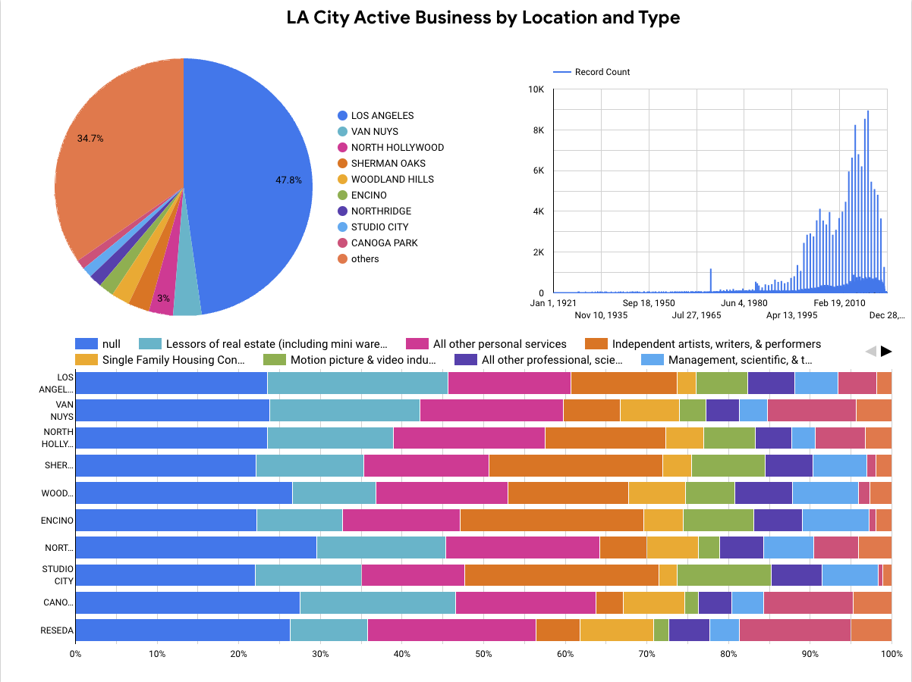

# Problem

While the raw data is freely available to the public, visualizing the data is not. Addtionally, the data is only exportable as a whole by navigating to their website. If you want to download the data via API, this has to be done in chunks.

This project's aim is to:
1. Provide a quick visualization for the Listing of Active Businesses
2. Provide a place to easily query the data as a whole 

> Dataset found at https://data.lacity.org/Administration-Finance/Listing-of-Active-Businesses/6rrh-rzua/about_data



# Reproducing the project
### Setup Google Cloud Project and Service Account
>**You will need** a Google Cloud Account for following the steps below.
- Create a project in Google Cloud Platform
- Create a Service Account with the following permissions:
  - Cloud Storage - Storage Admin
  - BigQuery - BigQuery Admin
  - Compute Engine - VM Admin
- Add key to your Service Account and download json key

## Project Setup

```
git clone https://github.com/mrcos-mrtinelli/dezoomcamp-project.git
cd dezoomcamp-project
```

### Setup Terraform and GCP Infrastructure
**NOTE:** The `ssh` and `credentials` directory contents will be ignored.

#### Create SSH Keys for VM
**NOTE:** Do not enter a passphrase. 
This newly created key will be added to your new VM in Google Compute. You will use this to SSH into the VM to run the pipeline later.

**NOTE:** For ease of reproduction, only edit what's within curly braces. For example, `cp do-not-edit-me {yes-edit-this}`.

```
ssh-keygen -t rsa -f terraform/ssh/vm_ssh_keys -C default_user -b 2048
``` 

#### Copy GCP Service Account Credentials to Project
**NOTE:** Command below will update the file name to `credentials.json`, leave it that way.

```
cp {path/to/your/credetials_file_name.json} mageai/lacity-active-businesses/credentials/credentials.json
```

## Running the Project 
First, we will use Terraform to create the infrastructure. Then, we will send the pipeline via SSH to your VM and access it via SSH using VS Code.

### Terraform
First, update the `project_id` variable in the `cstm.tfvars` file with the **project ID**, not the name.

```
cd terraform
code cstm.tfvars # or whatever editor you like to use
```

Once updated and changes saved, run:

```
terraform init
terraform plan --var-file cstm.tfvars
terraform apply --var-file cstm.tfvars
```

Upon completing, login to your GCP Account and get the **external IP** for the created VM called `default-vm`.

Then, create/update local `~/.ssh/config` file with the following so you can SSH to the VM with VS Code:

```
Host default-vm
  User default_user
  HostName {Paste the External IP for your new VM}
  IdentityFile {add/home/path/to/}dezoomcamp-project/terraform/ssh/vm_ssh_keys
```

### Setting Up Pipeline on VM:

Start by transferring the pipeline to the VM:

**NOTE:** Keep the `:` after the external IP. For example, `...default_user@127.0.01:` and NOT `...default_user@127.0.0.1`

```
cd .. # back into dezoomcap-project 
scp -r -i ./dezoomcamp-project/terraform/ssh/vm_ssh_keys mageai default_user@{External IP for VM}:
```

* Open VS Code and SSH into your VM using the `default-vm` config created earlier.
* Open VM Terminal in VS Code and then:
```
cd mageai
cp dev.env .env
```
* You will need both the **project ID** and the **bucket name** from your GCP.
    * Project ID can be found on the Dashboard
    * Bucket name can be found by going to Google Storage > Buckets
* Edit the `.env` file where applicable
```
code .env
```
* Save changes
* Install Docker and Docker Compose:

```
chmod +x install_docker.sh
./install_docker.sh
```

### Running the Pipeline
Start mage:
```
docker compose up
```

* Once Mage is running, in VS Code's terminal, click on Ports and foward the 6789 port 
* Open your browser and go to `http://localhost:6789/pipelines/lacity_active_businesses/triggers`
* Toggle the switch to activate the pipeline schedule (Run on the 15th of each month at 7:00 AM UTC)
* Click on **Run Once** then on Run Now

The pipeline should complete in about 10 minutes.

## Visualizing the Data
Once the pipeline completes it's run (should take about 10 min to complete running), go to BigQuery Studio.
* Click on your project name > bq_default > lacity-active-businesses
* Click Export > Explore with Looker Studio
* Authorize Looker Studio 
